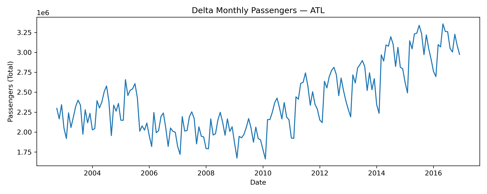
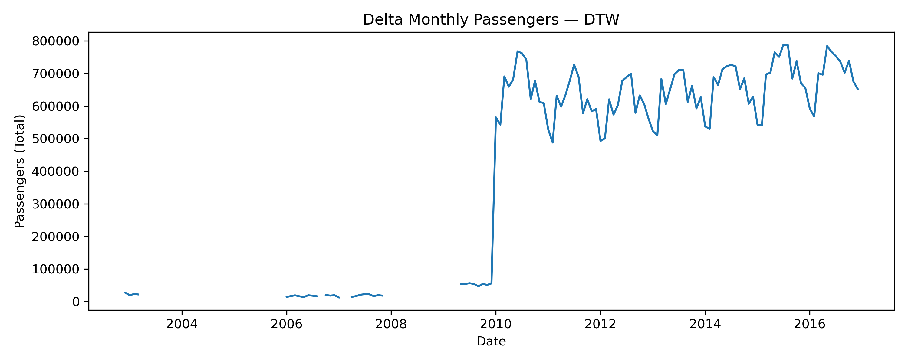
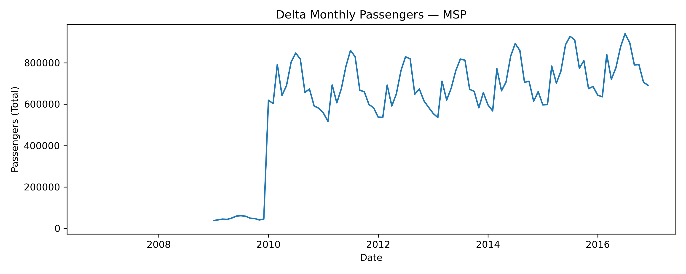
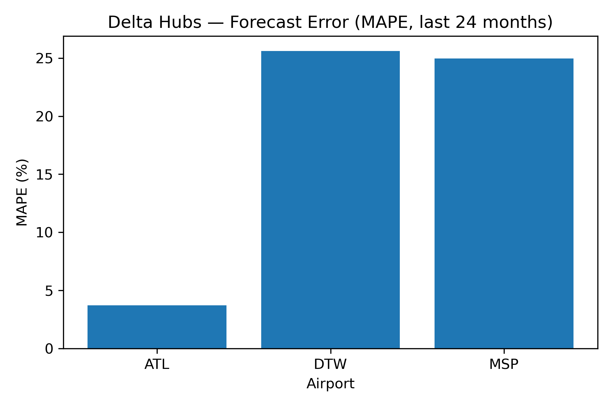
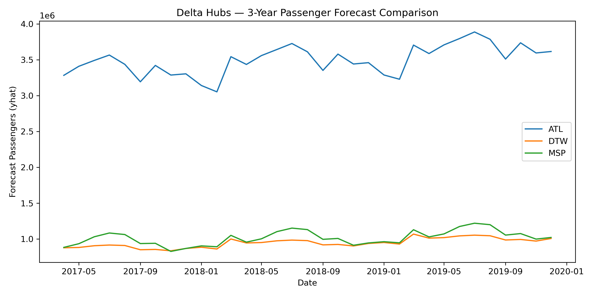

# ✈️ **Project B — Delta Airlines Demand Forecasting (ATL, DTW, MSP)**

*A time-series forecasting project analyzing Delta’s top three hubs using Prophet.*

---

## 📌 **Overview**

This project performs **demand forecasting** for **Delta Airlines** across its three primary U.S. hubs:

* **ATL — Atlanta (Primary Mega-Hub)**
* **DTW — Detroit (Upper Midwest Hub)**
* **MSP — Minneapolis (Northern Hub)**

Using 15+ years of monthly passenger data, the project evaluates:

* Historical demand patterns
* Forecast accuracy (backtesting)
* Three-year forward passenger forecasts
* Market volatility and predictability
* Hub-level growth expectations

The forecasting engine is built using **Meta Prophet**, with robust data cleaning, backtesting, and comparative evaluation.

---

## 📁 **Repository Structure**

```
Project_B_Delta_Airlines_Demand_Forecasting/
│
├── data/
│   ├── delta/                     # Raw Delta files by airport
│   ├── airlines_all_airports/     # Airport totals for comparison
│   └── airports_all_airlines/
│
├── output/
│   ├── clean/                     # Cleaned Delta ATL/DTW/MSP datasets
│   └── summary/                   # Final metrics summary (CSV)
│
├── images/
│   ├── atl/                       # ATL backtest & forecast plots
│   ├── dtw/                       # DTW backtest & forecast plots
│   ├── msp/                       # MSP backtest & forecast plots
│   └── summary/                   # Comparative visuals
│
├── notebooks/
│   ├── 01_data_preparation.ipynb
│   ├── 02_exploratory_analysis.ipynb
│   ├── 03_forecast_ATL.ipynb
│   ├── 04_forecast_DTW.ipynb
│   ├── 05_forecast_MSP.ipynb
│   └── 06_comparative_insights.ipynb
│
└── src/
    └── utils.py                   # Helper functions
```

---

## 🔧 **Tech Stack**

* **Python 3.11**
* **Prophet** (Meta)
* **Pandas / NumPy**
* **Matplotlib / Seaborn**
* **Jupyter Notebooks**

---

# 📊 **Exploratory Insights**

## ⭐ 1. Delta’s Total Passenger Trends at ATL, DTW, MSP

Each hub shows strong seasonality and long-term growth, with ATL being by far the largest and most stable.








---

# 🔍 **Backtesting: Forecast Accuracy (Last 24 Months)**

Accuracy was measured using:

* **MAE** – Mean Absolute Error
* **RMSE** – Root Mean Squared Error
* **MAPE** – Mean Absolute Percentage Error

### ✔ Backtest Results

| Airport | MAPE (%)  | MAE     | RMSE      |
| ------- | --------- | ------- | --------- |
| **ATL** | **3.72%** | 111,968 | 1,305,314 |
| **DTW** | 25.61%    | 169,939 | 187,675   |
| **MSP** | 24.97%    | 185,373 | 192,703   |

### 📉 Visual



### 🔎 Interpretation

* **ATL is extremely predictable**, with a MAPE under **4%**.
* **DTW and MSP are significantly more volatile**, causing higher forecasting error.
* Variability is driven by local market dynamics and smaller passenger volumes.

---

# 🔮 **Three-Year Forecasts**

Using Prophet retrained on the full dataset, we forecasted **36 months into the future**.

### 🔢 Forecast Summary

| Airport | Last Actual Pax | Last Forecast Pax (3y) | Growth   | Growth (%) |
| ------- | --------------- | ---------------------- | -------- | ---------- |
| **ATL** | 2,973,292       | 3,615,350              | +642,058 | **21.59%** |
| **DTW** | 652,549         | 1,008,403              | +355,854 | **54.53%** |
| **MSP** | 691,840         | 1,022,539              | +330,699 | **47.80%** |

### 📈 Combined Forecast Plot





### 🧠 Interpretation

* **ATL**: Mature mega-hub, steady and predictable growth.
* **DTW & MSP**: Higher growth potential but larger forecasting uncertainty.
* Growth % is high because base passenger volumes are lower.

---

# 🧭 **Business Insights**

### 🔹 ATL

* Strongest hub in the network.
* Highly predictable → ideal for long-term capacity planning.
* Low forecasting error makes this an operational model anchor.

### 🔹 DTW

* Moderate growth but exhibits volatility.
* Requires flexible fleet & crew scheduling strategies.

### 🔹 MSP

* Similar to DTW with competitive seasonality.
* Growth rate suggests expanding demand but requires risk buffers.

---

# 📘 **Methodology Summary**

1. **Dataset creation**

   * Combined domestic + international passengers
   * Converted to monthly series
   * Forward-filled missing months
   * Removed rows with missing pax

2. **Backtesting**

   * 24-month hold-out
   * Prophet trained on all prior data
   * Metrics computed over final 24 months

3. **Full Forecast Model**

   * Prophet retrained on complete dataset
   * Forecasted 36 months ahead
   * Growth metrics computed

---

# 📄 **Final Outputs Included**

### ✔ Cleaned datasets

`output/clean/delta_atl.csv`
`output/clean/delta_dtw.csv`
`output/clean/delta_msp.csv`

### ✔ Summary CSV

`output/summary/delta_hub_summary.csv`

### ✔ Forecast & Backtest Visuals

Located in:

```
images/atl/
images/dtw/
images/msp/
images/comparative/
```

---

# 🏁 **Conclusion**

This project demonstrates:

* Real-world forecasting workflow
* Clean data engineering
* Prophet model tuning
* Backtesting methodology
* Comparative hub performance analysis
* Business insight generation

It is a strong indicator of experience in:

**Aviation analytics · Forecasting · Time-series modeling · Business insights · Data visualization**